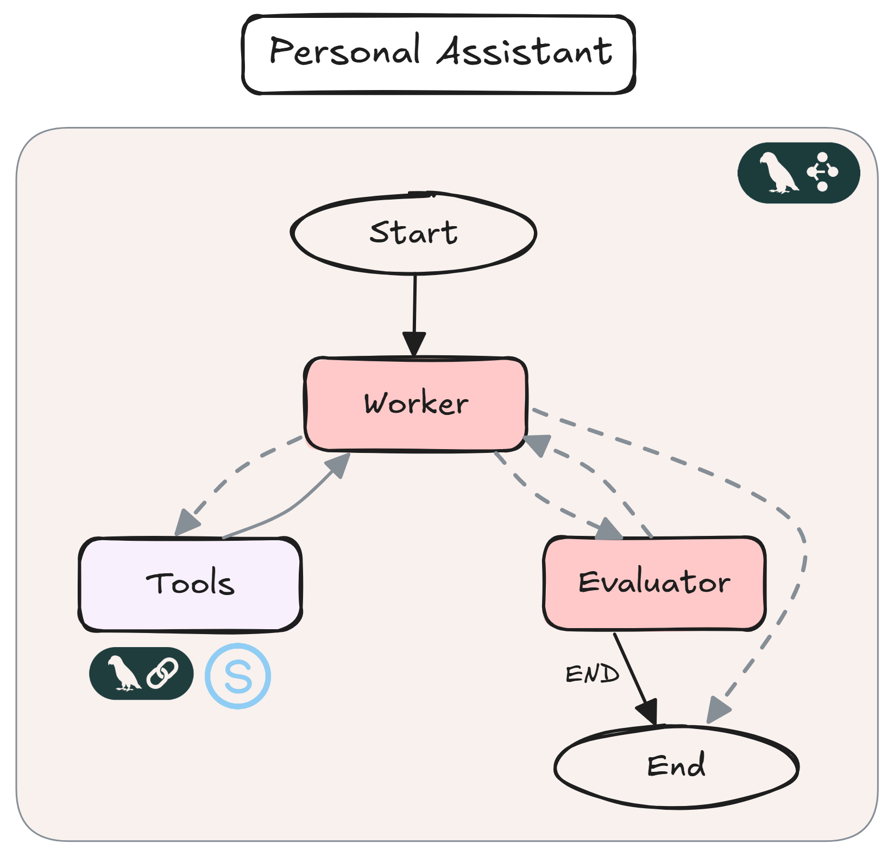

# Personal Agentic AI Assistant

## Project Overview
This project implements a personal assistant powered by an agentic AI. It can help you with your daily personal tasks, such as browsing the web and sending emails. It is built using **LangGraph** and follows an **Evaluator/Worker** design pattern from [Anthropic](https://www.anthropic.com/engineering/building-effective-agents), allowing the users to include success criteria in their prompts. The assistant's capabilities are extended through the integration of various **tools**. 



## Main Tools & Technologies

This agentic AI system is built using the following core tools:

- **LangGraph**: for building agentic workflows.
- **LangSmith**:  for tracing and monitoring.
- **OpenAI API (GPT-4)**: as the main LLM for task completion and planning.
- **Gradio**: a simple UI for interacting with the personal assistant.

## Agent Tools
The worker agent uses the following tools:
1. [PlayWright Browser ToolKit](https://python.langchain.com/docs/integrations/tools/playwright/) : for computer and Browser use.
2. [Google Serper](https://python.langchain.com/docs/integrations/tools/google_serper/) : for accessing Google Search.
3. [SendGrid Email API](https://sendgrid.com/en-us) : for sending emails.
   
## Installation & Running
1. This project uses UV for dependency management and package handling, offering a seamless setup and execution experience. So you need first to install uv: 
 ```bash
   pip install uv
   ```
2. To install all the project dependencies, run :
```bash
  uv sync 
   ```
3. Then you need to add the required keys into the .env file:
  - OPENAI_API_Key
  - SENDGRID_API_KEY
  - SERPER_API_KEY
  - LANGSMITH_API_KEY
4. To kickstart your agentic AI system and begin interacting with the worker agent, run this from the root folder of your project:
 ```bash
   uv run app.py
   ```
## Learning Resources
1.  [Building Effective Agents](https://www.anthropic.com/engineering/building-effective-agents)
2.  [The complete Agentic AI Engineering Course](https://www.udemy.com/course/the-complete-agentic-ai-engineering-course/?couponCode=KEEPLEARNING)
   

